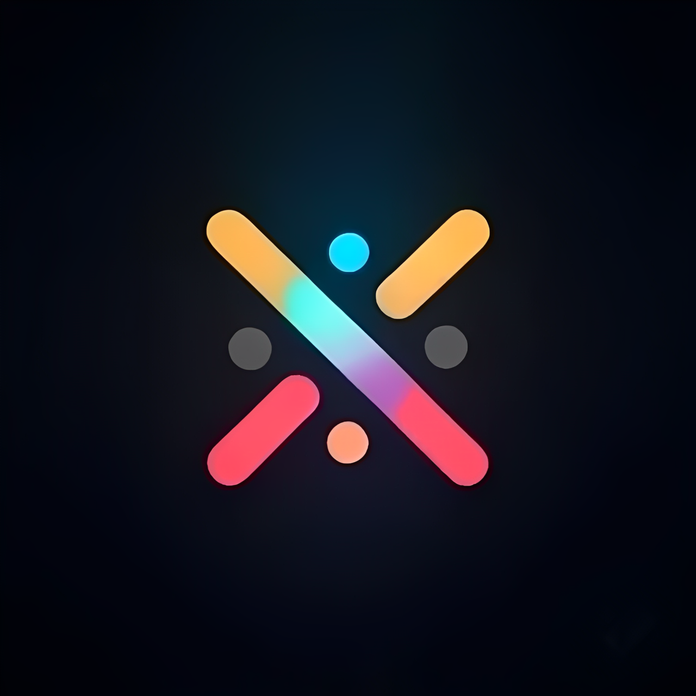

# MovieDex - Open Source Movie Streaming App

<p align="center">
  
</p>

MovieDex is a Flutter-based movie and TV show streaming application that provides a beautiful user interface and rich features for streaming enthusiasts.

## Features

- 🎬 Movie & TV Show Streaming
- 🔍 Advanced Search
- 📱 Responsive Design
- 🌙 Dark/AMOLED Theme
- 🔄 Continue Watching
- 📋 Watchlist Management
- 🔐 User Authentication
- 🔄 Cloud Sync
- 📺 Multiple Video Quality
- 🌐 Proxy Support

## Screenshots

[Add your app screenshots here]

## Setup Instructions

### Prerequisites
- Flutter SDK (3.0 or higher)
- Dart SDK
- Android Studio / VS Code
- Git

### Installation Steps

1. Clone the repository:
```bash
git clone https://github.com/kodify-js/MovieDex-Flutter.git
cd MovieDex-Flutter
```

2. Install dependencies:
```bash
flutter pub get
```

3. Setup TMDB API:
   - Sign up at [TMDB](https://www.themoviedb.org/signup)
   - Get your API key from [API Settings](https://www.themoviedb.org/settings/api)
   - Create `lib/api/secrets.dart`:
```dart
const String apiKey = 'YOUR_TMDB_API_KEY';
```

4. Firebase Setup:
   - Create a new Firebase project
   - Enable Authentication and Realtime Database
   - Download `google-services.json` and place in `android/app/`
   - Add Firebase configuration to your project:
```bash
flutter pub add firebase_core
flutter pub add firebase_auth
flutter pub add firebase_database
```

5. Generate Hive Adapters:
```bash
flutter pub run build_runner build
```

6. Run the app:
```bash
flutter run
```

## Configuration

### Firebase Setup Details
1. Go to [Firebase Console](https://console.firebase.google.com/)
2. Create a new project
3. Add Android app:
   - Package name: `com.kodify.moviedex`
   - Download `google-services.json`
4. Enable Authentication:
   - Go to Authentication > Sign-in method
   - Enable Email/Password
5. Setup Realtime Database:
   - Create database in test mode
   - Set up rules for user data

### TMDB API Setup
1. Create account on [TMDB](https://www.themoviedb.org/)
2. Request an API key
3. Create `secrets.dart`:
```dart
const String apiKey = 'YOUR_API_KEY';
```

## Contributing

1. Fork the Project
2. Create your Feature Branch (`git checkout -b feature/AmazingFeature`)
3. Commit your Changes (`git commit -m 'Add some AmazingFeature'`)
4. Push to the Branch (`git push origin feature/AmazingFeature`)
5. Open a Pull Request

## License

This project is licensed under the MIT License - see the [LICENSE](LICENSE) file for details

## Acknowledgments

- [TMDB](https://www.themoviedb.org/) for providing the movie database
- [Flutter](https://flutter.dev/) for the amazing framework
- [Firebase](https://firebase.google.com/) for backend services

## Support

If you find this project helpful, please give it a ⭐️!

For help getting started with Flutter development, view the
[online documentation](https://flutter.dev/docs), which offers tutorials,
samples, guidance on mobile development, and a full API reference.

## Contributors

### Core Team

- **[KodifyJs](https://github.com/kodify-js)** - *Project Lead*
  - Core architecture
  - Video player implementation
  - Content providers

### Contributors

<table>
  <tr>
    <td align="center">
      <a href="https://github.com/kodify-js">
        
        <br />
        <sub><b>KodifyJs</b></sub>
      </a>
    </td>
    <td align="center">
      <a href="https://github.com/aviralsharma954">
        
        <br />
        <sub><b>Aviralsharma954</b></sub>
      </a>
    </td>
    <!-- Add more contributors here -->
  </tr>
</table>

## Project Structure

Key features and their locations:

```
lib/
├── api/              # API and data layer
├── components/       # Reusable UI components
├── pages/           # Application screens
├── providers/       # State management
├── services/        # Business logic
└── utils/          # Helper functions
```

### Key Files

- `lib/api/contentproviders/` - Streaming source implementations
- `lib/components/content_player.dart` - Video player component
- `lib/services/watch_history_service.dart` - History tracking
- `lib/services/firebase_service.dart` - Authentication
- `lib/services/cache_service.dart` - Local caching

See [CONTRIBUTING.md](CONTRIBUTING.md) for detailed project structure and contribution guidelines.

### DMCA disclaimer
The developers of this application do not have any affiliation with the content available in the app. It collects content from sources that are freely available through any web browser.
